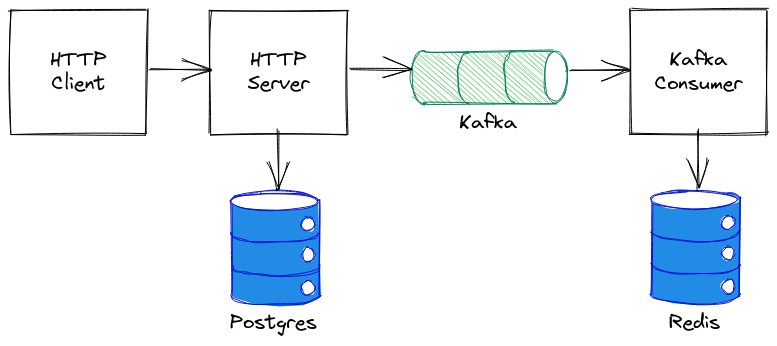
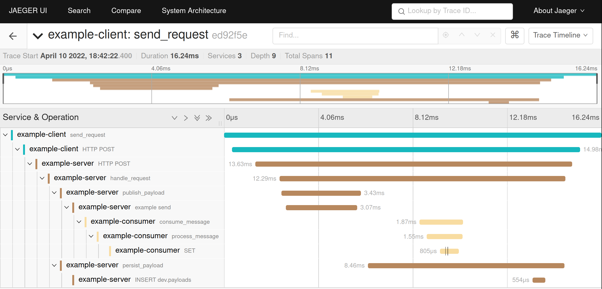

# OpenTelemetry + ZIO

An experiment which attempts to make OpenTelemetry instrumentation work with ZIO.

## How it works

This hacky solution uses a special [ZIO supervisor](src/main/scala/zio/OpenTelemetrySupervisor.scala) that takes a
snapshot of the current OpenTelemetry context before a new ZIO fiber is started and uses it as a parent context in the
scope of that fiber.

Each time a fiber is suspended, supervisor takes a fresh snapshot of the current context and then restores the root
context. When fiber is resumed, it restores the last context snapshot for that fiber.

When fiber is completed, supervisor restores the root context.

Probably, this is not the most correct implementation, but it does seem to work.

## Performance

Obviously, this context juggling induces a significant overhead. My absolutely basic and
unreliable [benchmarks](docs/BENCHMARKS.md) show that overhead is not very significant (~2%) when IO is involved. On
pure computations overhead reaches ~28%.

## Example

This project includes an example that involves:

* HTTP Client
* HTTP Server
* Postgres
* Kafka publisher and consumer
* Redis

Data which is sent between components is just a random UUID. To make sure that traces are collected correctly, each
manual span (i.e. which is not added by OpenTelemetry instrumentation agent) has a tag with the value of that UUID.

### Components diagram



### Collected trace in Jaeger



### Running the example

First you need to start all the dependencies using Docker Compose:

```shell
$ docker-compose up -d
```

Download OpenTelemetry JAR (e.g. using [Coursier](https://get-coursier.io)):

```shell
$ OTEL_AGENT_PATH=$(cs fetch --classpath "io.opentelemetry.javaagent:opentelemetry-javaagent:1.18.0")
```

Then start each component:

```shell
$ sbt -J-Dotel.service.name=example-consumer \
      -J-Dotel.traces.exporter=jaeger \
      -J-Dotel.exporter.jaeger.endpoint=http://localhost:14250 \
      -J-Dotel.propagators=jaeger \
      -J-Dotel.traces.sampler=always_on \
      -J-javaagent:$OTEL_AGENT_PATH \
      "runMain example.KafkaConsumer"
$ sbt -J-Dotel.service.name=example-server \
      -J-Dotel.traces.exporter=jaeger \
      -J-Dotel.exporter.jaeger.endpoint=http://localhost:14250 \
      -J-Dotel.propagators=jaeger \
      -J-Dotel.traces.sampler=always_on \
      -J-javaagent:$OTEL_AGENT_PATH \
      "runMain example.HttpServer"
$ sbt -J-Dotel.service.name=example-client \
      -J-Dotel.traces.exporter=jaeger \
      -J-Dotel.exporter.jaeger.endpoint=http://localhost:14250 \
      -J-Dotel.propagators=jaeger \
      -J-Dotel.traces.sampler=always_on \
      -J-javaagent:$OTEL_AGENT_PATH \
      "runMain example.HttpClient"
```

After a short moment you should see your traces in Jaeger UI ([http://localhost:16686](http://localhost:16686)).